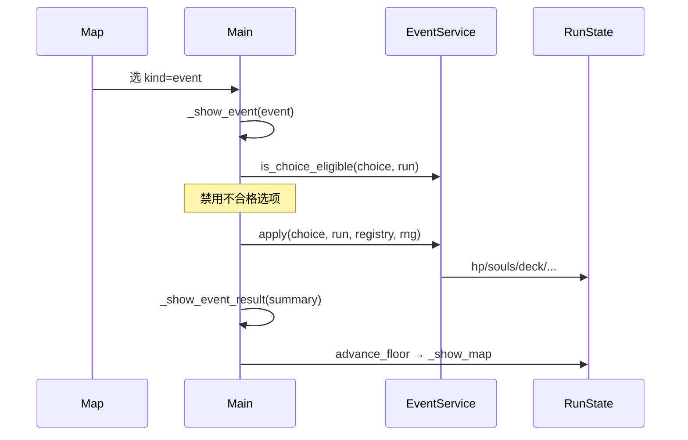

# 阶段十：地图事件节点 — 设计规格

**日期：** 2026-05-21  
**状态：** 阶段十已实现（2026-05-21）  
**前置：** 阶段九 `ActData` / `MapEncounterData`、阶段三赐福、阶段四商人  
**实现计划：** `docs/superpowers/plans/2026-05-21-phase10-map-events.md`

---

## 1. 目标与范围

### 1.1 问题

地图节点类型目前只有 **combat / elite / boss / grace / merchant**。README 提到的「艾雷教堂、关卡前废墟……」等叙事，大多已并入**战斗遭遇标题**，缺少《杀戮尖塔》式 **? 事件**：

- 无战斗的风险/收益抉择
- 跑团节奏在「打架—营火—商店」之外缺少第三拍
- 卢恩、生命、牌组的非战斗调节手段仍偏少

### 1.2 目标

引入 **地图事件（`kind: "event"`）**：玩家进入后阅读短文，从 **2～3 个选项** 中选一项，立即结算并 **进下一层**（与赐福/商人相同，不触发战斗）。

| 能力 | 说明 |
|------|------|
| 数据化 | `MapEventData` + `MapEventChoiceData` + `data/events/*.tres` |
| 逻辑集中 | `EventService`：资格判断、`apply(choice)` |
| 按幕投放 | `ActData.event_ids` 进入地图随机池；每幕 **2 个** 事件进池 |
| UI | `Main._visit_event` / `_show_event` / `_show_event_result`（复用 `REWARD` 层） |

### 1.3 验收标准

| # | 标准 |
|---|------|
| E1 | 地图可出现 `kind: "event"` 选项；选后显示选项按钮，选一项后展示结果并 `advance_floor()` |
| E2 | ≥ **6** 个事件 `.tres`（每幕 2 个），由 `tools/build_events.py` UTF-8 生成 |
| E3 | `EventService` 支持首版 effect 表（见 §3.2）；卢恩不足 / 生命不足时选项禁用 |
| E4 | `MapGenerator` 从 `act.event_ids` 解析事件并生成选项字典 |
| E5 | `tools/event_service_test.gd` 通过；`tools/smoke_test.gd` 与 `act_content_test.gd` 仍通过 |
| E6 | 实现后 **git commit** |

### 1.4 非目标（YAGNI）

- 事件链（多屏叙事）、战斗内事件、随机事件表权重
- 事件插图、配音、分支地图
- 与 NPC 对话树、咖列专属事件（可后续叠在 merchant 上）
- 新 `GameScreen` 枚举（继续用 `REWARD` 层）
- 全库 20+ 事件；首版 **6 个** 即可验证管线

---

## 2. 玩家体验

### 2.1 流程



### 2.2 与赐福 / 商人的区别

| | 赐福 | 商人 | **事件** |
|---|------|------|----------|
| 费用 | 多数免费；命定之死耗卢恩 | 卢恩购买 | 选项可含卢恩/生命代价 |
| 结构 | 三选一 **升级** | 货架多次购买 | 叙事 + **后果各异** 的 2～3 选 1 |
| 删牌/战灰 | 支持 | 支持 | 首版仅 **删牌** 或 **得牌** 简单效果，不做战灰 |

---

## 3. 技术设计

### 3.1 新 Resource

**`MapEventChoiceData.gd`**

```gdscript
@export var id: String = ""           # 选项 id（日志用）
@export var label: String = ""        # 按钮文案
@export var effect: String = ""       # 见 §3.2
@export var effect_value: int = 0
@export var soul_cost: int = 0        # 先扣再执行（0 表示无）
@export var card_id: String = ""      # add_card 用
@export var min_deck_size: int = 0    # remove_card 资格
```

**`MapEventData.gd`**

```gdscript
@export var id: String = ""
@export var title: String = ""
@export var body: String = ""
@export var choices: Array[MapEventChoiceData] = []
```

**`ActData` 扩展**

```gdscript
@export var event_ids: Array[String] = []   # 如 ["limgrave_corpse", "limgrave_merchant_ghost"]
```

`MapGenerator.options_for_floor` 对每个 `event_id`：

```gdscript
pool.append({
  "kind": "event",
  "event_id": event_id,
  "title": event.title,
  "body": event.body,
})
```

### 3.2 首版 `effect` 表

| effect | 行为 | 资格 |
|--------|------|------|
| `heal_percent` | `hp += ceil(max_hp * value / 100)` | `hp < max_hp` |
| `damage_percent` | `hp -= ceil(max_hp * value / 100)` | `hp > 1`（扣后至少剩 1） |
| `gain_souls` | `souls += value` | 始终可选 |
| `lose_souls` | `souls -= value`（先扣 soul_cost 再扣 effect 时合并） | `souls >= soul_cost + value` |
| `max_hp` | `max_hp += value; hp += value` | 始终可选 |
| `add_card` | `deck.append(card_id)` | `card_id` 非空且卡牌存在 |
| `remove_card` | 返回 `PICK_CARD`（与 Grace 相同） | `deck.size() > min_deck_size` |
| `refill_flasks` | `flasks = max_flasks` | `flasks < max_flasks` |
| `nothing` | 仅叙事 | 始终可选 |

**卢恩：** 所有选项先检查 `souls >= soul_cost`，不足则 UI 禁用。

**删牌：** `apply` 返回常量 `EventService.PICK_CARD`；`Main` 复用 `_show_remove_card_picker`，完成后 `_show_event_result` + `advance_floor`。

### 3.3 `EventService`

```gdscript
class_name EventService
extends RefCounted

const PICK_CARD := "__event_pick_card__"

func load_from_registry(registry: DataRegistry) -> void
func get_event(event_id: String, registry: DataRegistry) -> MapEventData
func is_choice_eligible(choice: MapEventChoiceData, run: RunState, registry: DataRegistry) -> bool
func apply(choice, run, registry, rng) -> String   # 结果摘要或 PICK_CARD
```

`DataRegistry` 增加 `_load_events()`、`get_event(id)`、`all_event_ids()`。

### 3.4 `Main.gd`

| 函数 | 职责 |
|------|------|
| `_choose_map_option` | `"event"` → `_visit_event(option.event_id)` |
| `_visit_event(event_id)` | 加载 `MapEventData`，`_show_event` |
| `_show_event(event)` | 标题、正文、选项按钮（资格禁用） |
| `_on_event_choice(choice, event)` | `apply` → 结果屏或删牌 picker |
| `_show_event_result(title, body)` | 「继续」→ `advance_floor()` + `_show_map()` |

`_map_choice_card`：对 `kind == "event"` 显示标题/正文（与 grace 类似，无敌人名）。

### 3.5 首版事件表（6 个）

| id | 幕 | 标题 | 选项示例 |
|----|-----|------|----------|
| `limgrave_corpse` | 1 | 褪色者遗骸 | 搜刮（+25 卢恩）/ 敬拜（+8% 最大生命）/ 离开 |
| `limgrave_beggar` | 1 | 流浪乞儿 | 给 20 卢恩（下一段 +15% 回血）/ 无视 |
| `stormveil_armory` | 2 | 废弃军械库 | 拿走战斧牌（`battle_axe`）/ 触发陷阱（-15% 生命） |
| `stormveil_shrine` | 2 | 英雄墓旁祭坛 | 补血瓶 / 献祭 30 卢恩（+10% 最大生命） |
| `liurnia_scholar` | 3 | 落灰学者 | 抄录辉石弧（`glintstone_arc`）/ 打扰他（-10% 生命） |
| `liurnia_drowned` | 3 | 溺水教堂遗声 | 聆听（+20 卢恩）/ 净化自身（清 debuff，需无 debuff 时仍可选但效果弱）→ 简化为 `refill_flasks` 或 `heal_percent` |

实现时文案可微调，但 **每幕 2 id** 写入 `build_acts.py` 的 `event_ids`。

### 3.6 `build_acts.py` 更新

每幕增加：

```python
"event_ids": ["limgrave_corpse", "limgrave_beggar"],
```

并输出 `event_ids = Array[String]([...])` 到 `.tres`。

---

## 4. 测试

### 4.1 `tools/event_service_test.gd`

1. 加载 `limgrave_corpse`，`gain_souls` 选项使 `souls` 增加  
2. `soul_cost` 不足时 `is_choice_eligible` 为 false  
3. `remove_card` 在 `deck.size() <= min_deck_size` 时不可用  

### 4.2 回归

- `map_generator_test`：floor 0 仍 3 选项（事件进入池后 kind 多样）  
- `act_content_test`：可为幕 0 增加断言 `event_ids.size() >= 2`  
- `smoke_test`：不改流程（可不强制走事件）

### 4.3 手工

- 地图出现事件节点 → 选选项 → 结果正确 → 进下一层  
- 卢恩不足时贪婪选项灰显  

---

## 5. 风险与决策

| 议题 | 决策 |
|------|------|
| 事件与固定节点 | 首版仅 **随机池** `event_ids`，不放入 `fixed_nodes` |
| 每幕几个事件进池 | `event_ids` 全进池 shuffle；幕内 2 个事件 = 2 个额外选项权重 |
| 池子变大导致战斗变少 | 可接受；12 层中事件占 ~6 槽位，仍 plenty combat |
| `MapNodeData.kind=event` | **不用** 扩展 MapNodeData；地图选项用字典 + `event_id` 字段即可 |

---

## 6. 文档与提交

- 实现后更新本文件状态、README「已实现」列表  
- `CLAUDE.md`：Recommended Next → 平衡性 / 新卡牌 / 事件插图  
- 提交：`feat(game): phase 10 map event nodes with EventService`
