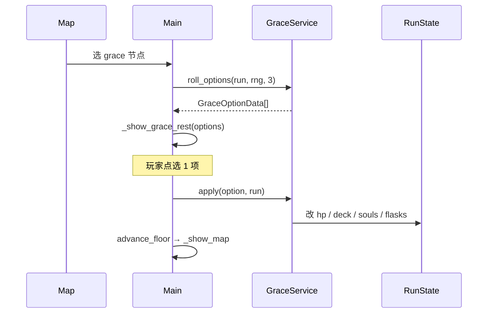

# 阶段三：赐福升级 — 设计规格

**日期：** 2026-05-21  
**状态：** 阶段三已实现（2026-05-21）  
**前置：** 阶段一 L2 架构、阶段二三幕 12 层地图（见 `2026-05-21-architecture-three-act-design.md`）  
**实现计划：** `docs/superpowers/plans/2026-05-21-phase3-grace-upgrades.md`

---

## 1. 目标与范围

### 1.1 目标

将赐福节点从「固定回血 + 自动买命定之死」改为 **营火式三选一**：玩家每次进入赐福时，在若干升级效果中选 **恰好 1 项**，然后进入下一层。

保持 Elden Ring 主题用语（赐福、圣杯瓶、卢恩、锻造台），玩法节奏对齐《杀戮尖塔》营火决策深度，但 **不引入新地图节点类型**（仍用 `kind: "grace"`）。

### 1.2 验收标准

| # | 标准 |
|---|------|
| A1 | 地图选赐福 → 出现 3 个可点击选项（标题 + 说明）；选 1 个后应用效果并 `advance_floor()` |
| A2 | 选项数据来自 `data/grace_options/*.tres`，新增选项无需改 `Main.gd` 大段逻辑 |
| A3 | 《命定之死》不再在赐福时自动扣卢恩；改为池内可选项，条件不满足时选项禁用或不出现在池中 |
| A4 | `tools/smoke_test.gd` 六出身仍通过；新增 `tools/grace_service_test.gd` 断言效果应用 |
| A5 | 1280×720 下赐福 UI 不溢出（复用 `reward_layer` 或同等布局） |

### 1.3 非目标（YAGNI）

- 商人咖列、护符、记忆石、战灰替换
- 赐福「升级卡牌数值」（Smith）— 留阶段四或独立变更
- 按幕不同赐福池（首版全局池 + 权重即可）
- 拆分 `Main.gd` 为多场景（L3）
- 地图节点超过 3 选 1 的赐福变体

---

## 2. 玩家体验

### 2.1 流程（替换现 `_visit_grace`）



### 2.2 与现行为差异

| 现行为 | 阶段三 |
|--------|--------|
| 进赐福即 +18 HP、补瓶 | **不再默认**；「休憩」变为池内选项之一 |
| 卢恩 ≥45 自动买《命定之死》 | 仅当玩家选中 `destined_death` 选项且满足条件时购买 |
| 单按钮「继续」 | 三选项各带「选择」；选后显示结果摘要再「继续」 |

### 2.3 首版选项池（6 项，每次随机 3 个）

| id | 显示名 | effect | 说明 |
|----|--------|--------|------|
| `rest` | 休憩 | `heal_percent` 0.35 | 回复 35% 最大生命（向上取整），补满圣杯瓶 |
| `vitality` | 熔炉百相·生命力 | `max_hp` +8 | `max_hp += 8`，`hp = min(hp+8, max_hp)` |
| `kindling` | 添火 | `max_flasks` +1 | `max_flasks += 1`，`flasks = max_flasks`；上限 **5** |
| `purge` | 遗忘仪式 | `remove_card` | 从牌组删 1 张（玩家点选）；牌组 ≤5 张时不入池 |
| `clarity` | 净化 | `clear_debuffs` | 清除腐败/出血/易伤；不清力量 |
| `destined_death` | 窥见命定之死 | `add_card` destined_death | 消耗 45 卢恩；牌组已有或卢恩不足则不入池 |

权重：均等随机；`purge` / `destined_death` 在条件不满足时从候选池剔除后再抽 3 个。

---

## 3. 技术设计

### 3.1 新资源与模块

```
data/
  GraceOptionData.gd      # 赐福选项 Resource
  grace_options/
    rest.tres
    vitality.tres
    ...
scripts/core/
  GraceService.gd         # roll_options, apply, eligibility
```

**GraceOptionData** 字段：

```gdscript
@export var id: String = ""
@export var title: String = ""
@export var body: String = ""
@export var effect: String = ""       # 见 §3.2
@export var effect_value: int = 0   # 如 max_hp 增量、heal 万分比×100
@export var soul_cost: int = 0
@export var min_deck_size: int = 0  # purge 用，默认 6
```

**GraceService** API：

```gdscript
func load_options(registry: DataRegistry) -> void
func roll_options(run: RunState, rng: RandomNumberGenerator, count: int = 3) -> Array[GraceOptionData]
func is_eligible(option: GraceOptionData, run: RunState) -> bool
func apply(option: GraceOptionData, run: RunState) -> String  # 结果摘要文案
```

`DataRegistry` 增加 `grace_options: Dictionary`（id → Resource）与 `_load_grace_options()`，或在 `GraceService.load_options` 内自载——**推荐 Registry 统一加载**，与卡牌/幕一致。

### 3.2 效果表（`effect` 字符串）

| effect | 行为 |
|--------|------|
| `heal_percent` | `heal = ceili(run.max_hp * effect_value / 100.0)`；`hp = min(max_hp, hp+heal)`；`flasks = max_flasks` |
| `max_hp` | `max_hp += effect_value`；`hp += effect_value` |
| `max_flasks` | `max_flasks = mini(5, max_flasks + effect_value)`；`flasks = max_flasks` |
| `remove_card` | 返回特殊标记；**Main** 打开删牌 UI，删后再 `advance_floor` |
| `clear_debuffs` | `rot/bleed/vulnerable = 0` |
| `add_card` | `souls -= soul_cost`；`deck.append(effect_value 作 card_id 或单独 @export card_id)` |

`add_card` 实现：`@export var card_id: String` 专用于 `destined_death`。

### 3.3 UI（Main.gd）

- 新屏态：复用 `GameScreen.REWARD` + `reward_layer`，或增加 `GameScreen.GRACE`（推荐 **REWARD 复用**，少改 enum）。
- `_show_grace_rest(options: Array)`：HBox 三列卡片，每列标题/正文/「选择」；禁用项灰显且不可点。
- `_apply_grace_option(option)`：
  - 若 `remove_card` → `_show_grace_remove_card()`（牌组列表按钮，删 1 张后摘要 + 继续）
  - 否则 `GraceService.apply` → `_show_message_end(grace_title, summary)`，`advance_floor` 在继续时执行（与现赐福一致）

**删牌 UI：** 列出 `run_state.deck` 中每张牌一次（按 id 聚合显示 count）；点选即从 `deck` 移除 **1 份** 该 id。

### 3.4 MapNodeData / ActData

- **不改** `MapNodeData` 结构；赐福节点仍为 `kind = "grace"`。
- `MapGenerator` 赐福节点文案可保留；进入后统一走新赐福流程。

### 3.5 与 CombatController

- 赐福治疗 **不经过** `combat.heal_player`（非战斗态）；`GraceService` 直接写 `RunState.hp`。
- 战斗外无 `combat` 依赖。

### 3.6 测试

| 脚本 | 断言 |
|------|------|
| `tools/grace_service_test.gd` | `apply(vitality)` 后 `max_hp` 增加；`roll_options` 在 deck≤5 时无 `purge`；卢恩不足无 `destined_death` |
| `tools/smoke_test.gd` | 赐福改为：调用 `_show_grace_rest` 的测试入口，或模拟选 `rest` 后 HP 上升 |

可选：`Main` 暴露 `_test_apply_grace(id)` 仅供 headless 调用。

---

## 4. 风险与缓解

| 风险 | 缓解 |
|------|------|
| 无自动回血导致暴毙 | `rest` 权重可略高；首版池内必含 1 个恢复类（roll 后若 0 个恢复则替换一个为 `rest`） |
| 删牌 UI 与 deck 查看重复 | 复用 `_card_counts` 展示 |
| smoke 依赖旧 `_visit_grace` | 冒烟改为 `_test_grace_pick("rest")` |

---

## 5. 后续衔接

- **阶段四（已立规格）：** 商人咖列 — `2026-05-21-phase4-merchant-colleen-design.md`
- 阶段五候选：护符 `RelicData`、按幕 `ActData.grace_option_weights`

---

## 6. 规格自检

- [x] 范围边界清晰，与阶段二无冲突
- [x] 可拆为单份 implementation plan
- [x] 无 TBD 占位；Boss/地图流程不变
