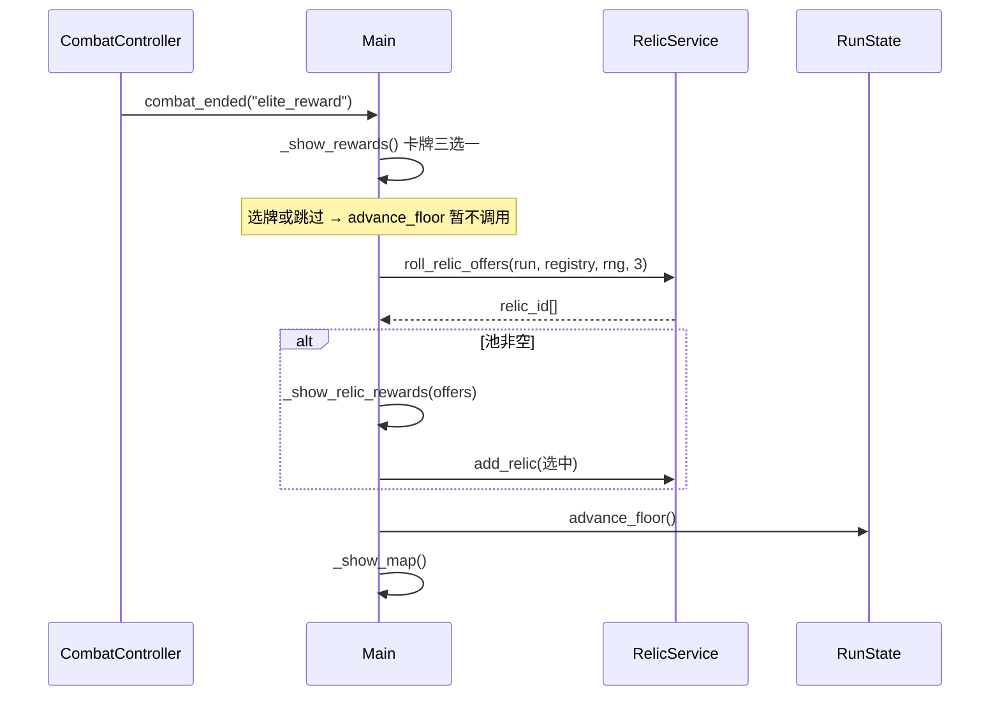

# 阶段八：战后护符奖励 — 设计规格

**日期：** 2026-05-21  
**状态：** 阶段八已实现（2026-05-21）  
**前置：** 阶段五护符（`RelicService` / `data/relics/*.tres`）、阶段七战灰替换  
**实现计划：** `docs/superpowers/plans/2026-05-21-phase8-post-combat-relics.md`

---

## 1. 目标与范围

### 1.1 目标

在 **精英战** 与 **幕末 Boss 战** 胜利后，让玩家从随机 **未持有** 护符中三选一（可跳过），与现有「战后卡牌三选一」形成分层奖励，减少对商人 `grant_relic` 的单一依赖。

| 战斗类型 | 战后流程（现状 → 目标） |
|----------|-------------------------|
| 普通战 | 卡牌三选一 → 下一层（不变） |
| 精英战（`is_elite`） | 卡牌三选一 → **护符三选一** → 下一层 |
| 幕末 Boss（`is_act_boss`） | 回满 + 卡牌三选一 → **护符三选一** → 下一层 |
| 最终 Boss（`is_run_boss`） | 直接胜利屏（不变） |

### 1.2 验收标准

| # | 标准 |
|---|------|
| R1 | 击败 `is_elite` 敌人后，先走现有卡牌奖励，再进入护符三选一界面 |
| R2 | `act_clear` 在卡牌奖励（或跳过）之后，同样进入护符三选一 |
| R3 | 护符池 = 全库 `RelicData` 中 **未持有** 项；不足 3 个时展示实际数量；池空则跳过护符屏直接 `advance_floor` |
| R4 | 选择护符调用 `RelicService.add_relic`（含 `on_acquire_max_hp` 等获得时效果）；跳过不获得 |
| R5 | 已持有护符不会出现在三选一池中（与商人 `grant_relic` 规则一致） |
| R6 | `tools/relic_reward_test.gd`（或扩展现有 `relic_service_test.gd`）覆盖 roll 池与 add；`tools/smoke_test.gd` 仍通过 |
| R7 | 实现后 **git commit**（阶段惯例） |

### 1.3 非目标（YAGNI）

- 护符稀有度、权重、按幕分池
- 重复护符叠加或「护符+」升级
- 普通战掉落护符
- 护符与卡牌同屏二选一（保持两步屏，逻辑清晰）
- 战后卢恩加成、遗物移除、图鉴 UI
- 新增护符种类（沿用阶段五 5 个即可；内容扩充留给阶段九）

---

## 2. 玩家体验

### 2.1 精英战流程



### 2.2 幕末流程

与精英相同，但入口为 `combat_ended("act_clear")`：

1. 现有 `_show_act_clear()`：回满生命/圣杯瓶 + 卡牌三选一 +「不取牌」
2. 卡牌步骤结束（选牌或跳过）后 → 护符三选一（**不再次** `advance_floor`，直到护符屏结束）
3. 护符屏结束 → `advance_floor()` → 地图

**注意：** 当前 `_reward_card` 与「不取牌」在卡牌步就会 `advance_floor()`，实现时需改为 **延迟进层**：卡牌奖励只改牌组，幕末/精英的 `advance_floor` 统一在护符屏之后执行。

### 2.3 护符奖励 UI

- 复用 `GameScreen.REWARD` / `reward_layer`
- 标题：**「护符」**；说明：击败强敌后发现的未绑定护符，选一件带走
- 横向 1–3 个面板：名称、描述、`hook` 摘要（如「战斗开始 +1 力量」）
- 底部：**「放弃」** → 不获得，进下一层
- 池空：不建屏，直接 `advance_floor()`（与跳过等价）

---

## 3. 技术设计

### 3.1 战斗结束信号

`CombatController.check_combat_end()` 在卢恩结算后：

```gdscript
if enemy.is_run_boss:
    combat_ended.emit("run_victory")
elif enemy.is_act_boss:
    combat_ended.emit("act_clear")
elif enemy.get("elite", false):  # 或 is_elite，与 DataRegistry 字典键一致
    combat_ended.emit("elite_reward")
else:
    combat_ended.emit("reward")
```

`Main._on_combat_ended` 增加分支：

| kind | 行为 |
|------|------|
| `reward` | `_show_rewards()` → 选/跳 → `advance_floor`（不变） |
| `elite_reward` | `_show_rewards_deferred()` → `_show_relic_rewards_then_map()` |
| `act_clear` | `_show_act_clear_deferred()` → 同上护符链 |
| 其他 | 不变 |

**延迟进层标志：** 卡牌奖励按钮与 skip 不再调用 `advance_floor()`，改为调用传入的 `Callable`（`on_card_reward_done`），由 Main 在精英/幕末路径串联护符屏。

### 3.2 RelicService 扩展

```gdscript
## 返回未持有护符 id 列表（已 shuffle，最多 count 个）
func roll_relic_offers(run: RunState, registry: DataRegistry, rng: RandomNumberGenerator, count: int = 3) -> Array
```

- 实现与 `grant_random_relic` 共用池构建逻辑，但 **不** 自动 `add_relic`
- `grant_random_relic` 可内部改为 `roll` + `add_relic` 以减少重复（可选重构）

### 3.3 Main.gd 新增/调整

| 函数 | 职责 |
|------|------|
| `_show_relic_rewards(relic_ids: Array, on_done: Callable)` | 护符三选一 UI |
| `_finish_combat_rewards()` | `advance_floor()` + `_show_map()` |
| `_show_rewards(..., advance_on_done: bool = true)` | 普通战 `true`；精英/幕末 `false` + callback |
| `_reward_card(..., on_picked: Callable)` | 选牌回调，不硬编码 `advance_floor` |

### 3.4 与商人护符的关系

| 途径 | 时机 | 随机方式 |
|------|------|----------|
| 商人 `grant_relic` | 购买瞬间 | 随机 1 个未持有，立即入包 |
| 精英/幕末战后 | 卡牌奖励之后 | 展示 3 个未持有，玩家选 1 或跳过 |

两者互斥展示规则相同；跑团末期池空时精英战仅保留卡牌奖励。

### 3.5 数据与敌人

无需新 `.tres` 类型。确保 `DataRegistry` 敌人字典含 `elite`（已有 `template.is_elite`）。

精英敌人示例（已标记 `is_elite = true`）：`kaguth_chief`、`gravekeeper_dualrander`、`stoneminer_fiend`、`warhound_of_famiazurla` 等。

地图 `MapGenerator` 中 `elite` 节点进入的战斗应加载对应 `EnemyData`。

---

## 4. 测试

### 4.1 `tools/relic_reward_test.gd`

1. 空 `relics` 时 `roll_relic_offers` 返回 ≤3 个且互不重复  
2. 持有全部 5 个护符时返回空数组  
3. `add_relic` 后池不再包含该 id  

### 4.2 冒烟 / 手工

- 选地图 **精英** 节点：战后应出现卡牌屏 → 护符屏  
- 幕末 Boss 层：回满 + 卡牌 → 护符  
- 普通战：仅卡牌，无护符屏  

---

## 5. 风险与决策

| 议题 | 决策 | 理由 |
|------|------|------|
| 精英是否还要卡牌奖励 | **要** | 与 StS 精英「牌+遗物」接近；本游戏卡牌池仍小，双奖励提升构筑感 |
| 幕末双奖励是否过强 | 首版保留 | 幕末一年 3 次，且护符池会随持有缩小 |
| 卡牌屏与幕末 skip 的 `advance_floor` | 延后到护符后 | 避免未选护符就进下一层 |
| 信号用 `elite_reward` 新 kind | 是 | 比给 `reward` 传参更少侵入 `CombatController` 调用方 |

---

## 6. 文档与提交

- 实现完成后更新本文件 **状态** 为「已实现」  
- `CLAUDE.md`「Recommended Next」移除战后护符项  
- 提交信息建议：`feat(game): phase 8 post-combat relic rewards for elite and act boss`
